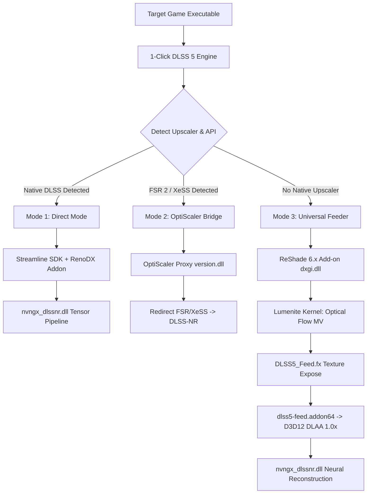

# ⚡ 1-Click DLSS 5 (v2.6.0-release)

### **Universal Neural Control Center • RTX 20/30/40/50 Series**
*Deploy Next-Generation DLSS 5 Neural Rendering into Any PC Game with Just 1 Click.*

---

> **Fork note (english-default branch):** the upstream release opened in Portuguese and the English switch left much of the UI untranslated or garbled, so this branch starts in English, fixes several GUI rendering problems, and ships a payload verification script. Read [`docs/FORK-NOTES.md`](docs/FORK-NOTES.md) first: it documents every change and contains a full security review of the v2.6.0 payload, including why `nvngx_dlssnr.dll` cannot be verified.

## 📖 Table of Contents
- [Overview](#-overview)
- [UI & Interface Previews](#-ui--interface-previews)
- [Key Features](#-key-features)
- [How It Works (Under the Hood)](#-how-it-works-under-the-hood)
- [The 3 Injection Modes](#-the-3-injection-modes)
- [Compatibility Matrix](#-compatibility-matrix)
- [Quick Start Guide](#-quick-start-guide)
- [1-Click Auto-Fix & Troubleshooting](#-1-click-auto-fix--troubleshooting)
- [System Requirements](#-system-requirements)
- [Dependencies & Tech Stack](#-dependencies--tech-stack)
- [Credits & Acknowledgments](#-credits--acknowledgments)
- [License](#-license)

---

## 🚀 Overview

**1-Click DLSS 5** is an open-source, automated neural rendering management suite designed to inject **NVIDIA DLSS 5 Neural Reconstruction (DLSS-NR)**, **Neural Uplift**, **Ray Reconstruction**, and **Synthetic DLAA Scaling** into **any PC game** regardless of whether the title natively supports DLSS.

Traditionally, integrating DLSS-NR, custom ReShade add-ons, optical flow estimation, and proxy DLLs required manual file placement, INI editing, shader path ordering, and complex configuration. **1-Click DLSS 5** unifies the entire ecosystem into a streamlined, high-performance GUI that handles game discovery, API detection, payload injection, optical flow calibration, and 100% clean factory restoration in a single click.

---

## 🖼️ UI & Interface Previews

### 1️⃣ Mode 1: Direct Injection Mode (Cyberpunk 2077 • Native DLSS)

*Streamlined HUD v2 layout with 3-step workflow, real-time D3D12 detection, and automated Mode 1 selection for native DLSS games.*

 

### 2️⃣ Mode 2: OptiScaler Bridge Mode (God of War • AMD FSR 2/3 & Intel XeSS)

*Redirects in-game AMD FSR 2/3 or Intel XeSS calls directly into the NVIDIA DLSS-NR neural model via proxy redirection.*

 

### 3️⃣ Mode 3: Universal Feeder Mode (Mafia: Definitive Edition • 100% Native DLAA)

*Engineered for games without any native upscalers using Lumenite Kernel optical flow motion vectors and zero loss of clarity.*

---

## 🌟 Key Features

- ⚡ **Native 64-Bit Compiled Executable (`1-Click-DLSS5.exe`):** Seamless silent execution with embedded high-resolution application icon, Windows 11 manifest, and Per-Monitor V2 High-DPI scaling (zero console flashing).
- 🎮 **Instant Game Auto-Discovery via Windows Registry:** Dynamic multi-drive scanning querying official Registry paths for **Steam**, **Epic Games**, **GOG Galaxy**, **Xbox Games**, and custom directories.
- 🎯 **Deterministic PE Import Table (IAT) Inspection:** Directly scans game binaries for D3D12, D3D11, Vulkan, and OpenGL imports, ensuring flawless API detection even without local DirectX DLLs.
- 📂 **Seamless Drag & Drop Support:** Drag any game folder or executable directly from File Explorer into the window to configure injection in 1 second.
- ⚡ **1-Click Auto-Fix Engine:** Automatically detects and resolves file locks, lingering background processes, and folder permissions (`attrib -r`) with zero manual effort.
- 🩺 **System Diagnostics Suite:** Built-in hardware checklist verifying RTX tensor capabilities, write permissions, process states, and runtime integrity.
- 🌍 **10 Native Languages:** Full dynamic UI translation with instant switching for English, Portuguese (BR), Spanish, German, French, Italian, Japanese, Simplified Chinese, Russian, and Korean.
- 🔄 **Universal Graphics API Support:** Direct interception and hooking for **DirectX 12, DirectX 11, DirectX 9, Vulkan, and OpenGL**.
- 🧱 **32-Bit (x86) & 64-Bit (x64) Support:** Transparent IPC bridge via `host64` to enable modern 64-bit neural models in legacy 32-bit executables.
- ↩️ **100% Clean Factory Restoration:** Surgical uninstaller that strictly preserves native game binaries (protects `sl.interposer.dll` and `sl.common.dll` in Witcher 3 / Cyberpunk) while wiping all injected mod files.

---

## 🔬 How It Works (Under the Hood)

1. **API & Upscaler Inspection:** The engine scans the game directory for headers, PE machine types (x86/x64), import tables, and existing upscaler signatures (`nvngx_dlss.dll`, `amd_fidelityfx_dx12.dll`, `ffx_fsr2*.dll`, `libxess.dll`).
2. **Proxy Injection:** Depending on the graphics API, the application places an appropriate wrapper (`dxgi.dll`, `d3d12.dll`, `d3d9.dll`, `opengl32.dll`, or `version.dll`).
3. **Motion Vector & Depth Feed:** For non-DLSS games, the **Lumenite Kernel** computes optical flow motion vectors in screen space (`RG16_FLOAT`) alongside depth linearization, feeding the synthetic DLAA feature contract ($1.0\times$ scale) in `dlss5-feed.addon64`.
4. **Neural Reconstruction:** The NVIDIA DLSS-NR model (`nvngx_dlssnr.dll`) processes the color buffer and motion vectors, eliminating noise, enhancing fine edge structures, and improving visual stability.

---

## 🎛️ The 3 Injection Modes

### 1️⃣ Mode 1: Direct Mode (Native DLSS)
- **Best For:** Games that natively ship with DLSS (*Cyberpunk 2077, Forza Horizon 5, Alan Wake 2, etc.*).
- **How it Works:** Injects **Streamline** interposer DLLs and the **RenoDX DLSS 5 Add-on** (`renodx-dlss5.addon64`), intercepting native NGX evaluate calls and upgrading standard DLSS upscaling to DLSS-NR Neural Reconstruction.
- **In-Game Setting:** Turn **ON** DLSS in the game's Video Settings (Quality / Balanced / Performance).

### 2️⃣ Mode 2: OptiScaler Bridge Mode (FSR2 / XeSS)
- **Best For:** Games that only support AMD FSR 2/3 or Intel XeSS (*God of War, Horizon Zero Dawn, Starfield, etc.*).
- **How it Works:** Injects **OptiScaler** as a proxy (`version.dll`), intercepting FSR2/XeSS API calls and redirecting them to the DLSS-NR neural pipeline.
- **In-Game Setting:** Turn **ON** FSR 2, FSR 3, or XeSS in the game's Video Settings.

### 3️⃣ Mode 3: Universal Feeder Mode (Synthetic DLAA 100% Native)
- **Best For:** Any DirectX 11, DirectX 12, Vulkan, OpenGL, or 32-bit game without any native upscalers (*Mafia Definitive Edition, GTA V, Dark Souls III, Final Fantasy X HD, etc.*).
- **How it Works:** Uses ReShade Add-on architecture + **Lumenite Kernel** optical flow motion estimation + **DLSS5-Feeder**. Creates a synthetic D3D12 DLAA device, evaluates DLSS-NR at 100% native resolution, and outputs pristine, reconstructed frames with zero blur and zero ghosting.
- **In-Game Setting:** Keep in-game upscalers **OFF** (Runs in 100% Native Screen Resolution).

---

## 📊 Compatibility Matrix

| Category | Supported Technologies / Games | Injection Mode |
| :--- | :--- | :--- |
| **Native DLSS Titles** | *Cyberpunk 2077, Forza Horizon 5, Hogwarts Legacy, Spider-Man Remastered* | **Mode 1 (Direct)** |
| **FSR 2 / 3 Only** | *God of War, Horizon Zero Dawn, Dead Island 2, The Last of Us Part I* | **Mode 2 (OptiScaler)** |
| **Intel XeSS Only** | *Shadow of the Tomb Raider, Ghostwire Tokyo, Chorus* | **Mode 2 (OptiScaler)** |
| **DirectX 11 Games** | *Mafia Definitive Edition, GTA V, Witcher 3 (DX11), Dark Souls III, Sekiro* | **Mode 3 (Feeder)** |
| **DirectX 12 (Non-DLSS)** | *Elden Ring, Halo Infinite, Star Wars Jedi: Survivor* | **Mode 3 (Feeder)** |
| **Vulkan / OpenGL** | *Doom (2016), Doom Eternal (Vulkan), No Man's Sky, Emulators (RPCS3, Ryujinx)* | **Mode 3 (Feeder)** |
| **32-Bit (x86) Classics** | *Final Fantasy X/X-2 HD, Skyrim (LE 32-bit), Fallout 3, New Vegas* | **Mode 3 (Feeder + Host64)** |
| **Unreal Engine 4 & 5** | *All UE4 / UE5 packaged titles with DX11 or DX12 runtimes* | **Auto-Detected** |

---

## ⚡ Quick Start Guide

1. **Download Release:** Grab the latest `1-Click-DLSS5-v2.5.2-beta.zip` from [Releases](https://github.com/reiluisii/1-Click-DLSS5/releases).
2. **Extract & Run:** Extract the archive and launch `1-Click-DLSS5.bat` (or use `1-Click-DLSS5.vbs` for silent execution).
3. **Select Game:** Choose your game from the auto-detected library or click `📁 BROWSE GAME` to select a game folder.
4. **Install:** The ideal mode is chosen automatically. Click `[⚡] 1-CLICK: INSTALL DLSS 5`.
5. **Play:** Click `[►] LAUNCH GAME NOW` and enjoy enhanced clarity and neural graphics!

---

## 🛠️ 1-Click Auto-Fix & Troubleshooting

If you encounter an issue (e.g., game opened in background, Windows read-only lock, or anti-cheat conflict):

1. Click the **`[⚡] RESOLVER PROBLEMA EM 1 CLIQUE`** (or **`1-CLICK AUTO-FIX`**) button in the error dialog.
2. The Auto-Fix engine will:
   - Terminate lingering background processes for the target game executable.
   - Strip recursive read-only attributes from the game folder.
   - Clean stale runtime state files and re-apply injection.
3. Open `📄 VER LOG COMPLETO` at the bottom right to inspect the continuous telemetry log file (`1-Click-DLSS5.log`).

---

## 💻 System Requirements

- **GPU:** NVIDIA GeForce RTX 20, 30, 40, or 50 Series (RTX 2060, RTX 3060, RTX 4070, RTX 5080, etc.).
- **OS:** Windows 10 (64-bit) or Windows 11 (64-bit).
- **Driver:** NVIDIA Game Ready Driver v535.xx or newer.
- **Runtimes:** Microsoft Visual C++ 2015–2022 Redistributable (x64 & x86).

---

## 📦 Dependencies & Tech Stack

- **UI Framework:** Windows Forms (.NET CLR) styled with modern dark theme design tokens.
- **Execution Engine:** PowerShell 5.1+ Native Scripting with Win32 P/Invoke integration.
- **Proxy Interception:** ReShade 6.x (Add-on Edition) by **crosire**.
- **Neural Uplift & Tone Mapping:** RenoDX Framework by **clshortfuse**.
- **Motion Estimation Kernel:** LumeniteFX Suite by **umar-afzaal**.
- **Synthetic DLAA Feeder:** DLSS5-Feeder (v0.12.0) by **jlrouzies-fr** & **NIGos**.
- **Upscaler Bridge:** OptiScaler by **cdozdil** & **Dagherbou**.
- **Neural Model:** NVIDIA NGX DLSS-NR SDK (`nvngx_dlssnr.dll`).

---

## 🤝 Credits & Acknowledgments

We extend our deep gratitude to the brilliant open-source graphics programming and modding community whose tools and research made this project possible:

- **[clshortfuse](https://github.com/clshortfuse)** — Creator of **RenoDX**, the groundbreaking ReShade add-on framework for HDR and DLSS-NR neural uplift.
- **[jlrouzies-fr](https://github.com/jlrouzies-fr)** — Creator of **DLSS5-Feeder**, enabling synthetic D3D12 DLAA and universal buffer transport for non-DLSS games.
- **[umar-afzaal](https://github.com/umar-afzaal)** — Author of **LumeniteFX**, providing the high-precision optical flow motion vector kernel (`Lumenite_Kernel.fx`).
- **[cdozdil](https://github.com/cdozdil)** & **[Dagherbou](https://github.com/Dagherbou)** — Creators of **OptiScaler** and **OptiScaler_DLSSNR**, enabling seamless FSR2/XeSS to DLSS-NR redirection.
- **[crosire](https://github.com/crosire)** — Creator of **ReShade**, the foundational post-processing and add-on injection runtime.
- **[NVIDIA Corporation](https://www.nvidia.com)** — Creators of the **DLSS SDK**, **Streamline**, and **NGX Neural Rendering**.
- **[Google DeepMind](https://deepmind.google)** — **1-Click DLSS 5** was architected, refactored, and engineered using **Gemini 3.7 Flash Thinking (High / Pro)**.

---

## 📄 License

This project is licensed under the **MIT License** — see the [LICENSE](LICENSE) file for details.
